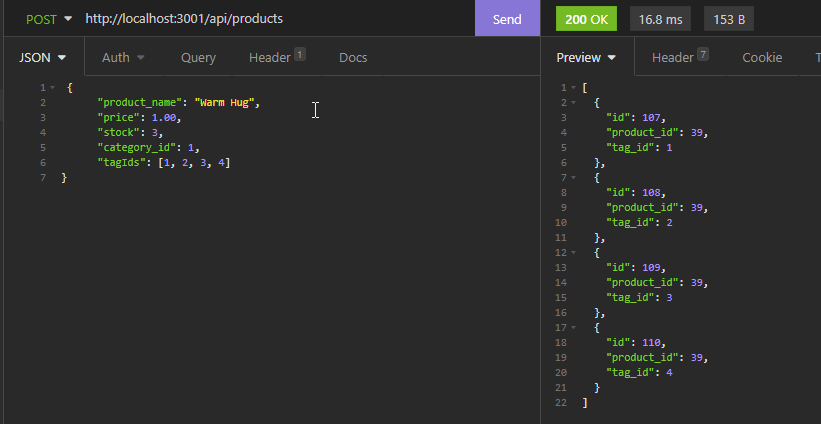
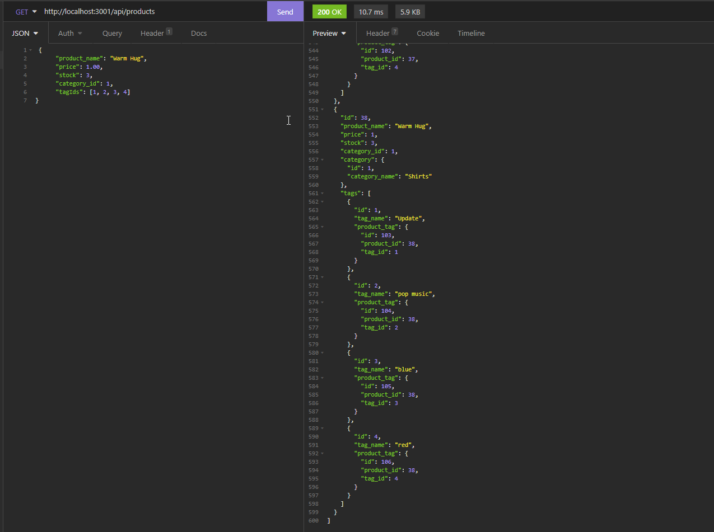
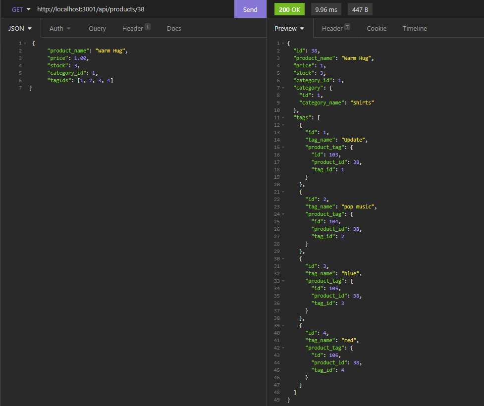

# Michael Ariti - Ecommerce Backend

[](https://opensource.org/licenses/MIT)

|  Table of Contents |
| ----------- |
| [1. Description.](#description)|
| [2. User Story.](#user-story) |
| [3. Acceptance Criteria.](#acceptance-criteria) |
| [4. Installation.](#installation) |
| [5. Usage.](#usage)|
| [6. License.](#license)|
| [7. Contributing.](#contributing)|
| [8. Technologies Used.](#technologies-used)|
| [9. Screenshot.](#screenshot)|
| [10. Video Demo.](#video-demo)|
| [11. Questions.](#questions)|

## Description

The purpose of this repository is to create a javascript server that runs in node which will allow a user to create and maintain an ecommerce database Using RESTful API methods. 

### Features
``` 
The ability to view by all Products, Tags & Categories.
The ability to view by individual Products, Tags & Categories, using their ID.
The ability to delete by individual Products, Tags & Categories, using their ID.
The ability to update by individual Products, Tags & Categories, using their ID.
The ability to create new Products, Tags & Categories.
```
## User Story

```md
AS A manager at an internet retail company
I WANT a back end for my e-commerce website that uses the latest technologies
SO THAT my company can compete with other e-commerce companies
```

## Acceptance Criteria

```md
GIVEN a functional Express.js API
WHEN I add my database name, MySQL username, and MySQL password to an environment variable file
THEN I am able to connect to a database using Sequelize
WHEN I enter schema and seed commands
THEN a development database is created and is seeded with test data
WHEN I enter the command to invoke the application
THEN my server is started and the Sequelize models are synced to the MySQL database
WHEN I open API GET routes in Insomnia for categories, products, or tags
THEN the data for each of these routes is displayed in a formatted JSON
WHEN I test API POST, PUT, and DELETE routes in Insomnia
THEN I am able to successfully create, update, and delete data in my database
```

## Installation

To install this app you are required to have MySQL set up and configured. Open the server.js file in a node terminal and use the command `npm install` to install the dependancies. Copy and rename the .env.EXAMPLE file as .env and then add your MYSQL details to the .env file (user is default set to root.) then open another terminal on the schema.sql run the command `mysql -u root -p` to start the mysql, then run source schema.sql to initialise the databse. If you wish to use the seed values then run `npm run seed` in the node terminal. Run `npm start` to begin the app. 

## Usage

To use this app it is reccomended to interact using Insomnia. Once it has been installed get, post, put and delete requests will work along the routes `/api/products`, `/api/catergories` & `/api/tags`. With individual Id routes using `/api/products/:id`, `/api/catergories/:id` & `/api/tags/:id.`

## License

This project uses the MIT license.

## Contributing

If you would like to contribute to the project please message my github.

## Technologies Used

1. Javascript
2. Node.js
3. SQL
4. Sequelize
5. Express.js
6. dotenv

## Screenshot




## Video Demo
[Video-Demo](https://drive.google.com/file/d/1s6smFDCr0YenQPAOazEQ2JueQNpW8TVu/view?usp=sharing)

## Questions

If you have Questions or tips please email me at the address below.

### Email
MichaelAriti94@gmail.com

### End

Michael Ariti 2022